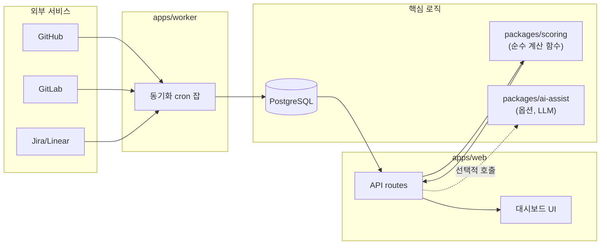

# RateYourCommit — MVP 아키텍처 설계 노트

> 프로젝트명: **RateYourCommit** ("당신의 커밋을 평가하라" — 흩어진 기여를 모아 공정하게 점수 매긴다는 의미). 버전 **0.0.1**.

## 0. MVP 범위 확정

7개 화면 풀스펙 중 아래 3개만 1.0 목표로 잡는다. 나머지(동료평가, 보상등급 산정)는 회사마다 인사정책이 크게 달라 일반화 난이도가 높으므로 v2 이후로 미룬다.

| 화면 | MVP 포함 |
|---|---|
| S-07 아이덴티티 매핑 | ✅ 핵심 차별점 |
| S-04 코드품질/커밋 연동 | ✅ |
| S-02 개인 스코어카드 | ✅ (가중치는 완전히 커스터마이징 가능하게) |
| S-01 대시보드 | ✅ (위 3개의 집계 뷰이므로 자연스럽게 포함) |
| S-03 프로젝트 집계, S-05 동료평가, S-06 보상등급 | ⏸ v2 이후, 플러그인 모듈로 분리 |

## 1. 기술 스택 선택 기준

셀프호스팅 대상이 데브옵스 전담 인력이 없는 소규모 팀이라는 점, 그리고 오픈소스는 컨트리뷰터 진입장벽이 낮을수록 성장한다는 점 두 가지를 최우선으로 삼는다.

| 영역 | 선택 | 이유 |
|---|---|---|
| 언어 | **TypeScript 단일 언어** (프론트/백/워커 전부) | 컨트리뷰터가 언어를 하나만 알면 전체 코드베이스에 기여 가능 — OSS 성장에 가장 큰 영향을 주는 결정 |
| 프론트엔드 | **Next.js 14 (App Router)** | 가장 익숙한 생태계, SSR로 대시보드 초기 로딩 빠름 |
| API | Next.js API Routes (또는 별도 Nest.js — 초기엔 분리하지 않음) | 리포지토리 하나로 단순하게 시작, 필요해지면 분리 |
| DB | **PostgreSQL** | 셀프호스팅 표준, JSON 컬럼으로 커넥터별 원시데이터도 유연하게 저장 |
| ORM | **Prisma** | 스키마가 곧 문서가 되어 비개발자 출신 관리자도 필드 의미 파악 쉬움 |
| 동기화 워커 | **cron 기반 스케줄 잡** (MVP) → 필요 시 BullMQ+Redis로 확장 | 초기엔 큐까지 안 만들어도 됨. 인프라 구성요소를 최소화해야 `docker compose up` 한 줄이 유지됨 |
| 패키지 매니저 | **npm workspaces** | pnpm 대비 추가 설치 없이 Node.js에 내장 — 셀프호스팅/컨트리뷰션 진입장벽을 한 단계 더 낮춤 |
| 배포 | **Docker Compose 단일 파일** | 대표/PM이 서버 담당자에게 "이 파일 하나만 실행해달라"고 요청할 수 있는 수준까지 단순화 |
| 인증 | 이메일/비밀번호 + GitHub OAuth (v1.0) | 개발도구이므로 GitHub 로그인 자연스러움, SSO는 유료 클라우드로 분리 |

## 2. 커넥터 아키텍처 (플러그인 구조)

특정 회사 인프라(GitLab+Jenkins+SonarQube)에 고정되지 않도록, 모든 외부 연동은 공통 인터페이스를 구현하는 어댑터로 분리한다.

```ts
// packages/connectors/src/types.ts
interface SourceConnector {
  id: string;                    // "github" | "gitlab" | "bitbucket" ...
  fetchAuthors(): Promise<RawIdentity[]>;
  fetchCommits(since: Date): Promise<RawCommit[]>;
}

interface TrackerConnector {
  id: string;                    // "github-issues" | "jira" | "linear" ...
  fetchTickets(since: Date): Promise<RawTicket[]>;
}
```

MVP 1.0 커넥터 우선순위: **GitHub(소스+이슈) → GitLab → Jira → Linear** 순. GitHub을 1순위로 잡는 이유는 소~중규모 조직에서 가장 점유율이 높고, OSS 컨트리뷰터 유입도 GitHub 생태계에서 가장 활발하기 때문.

## 3. 핵심 데이터 모델

```
Person            — 사번/조직 내 실제 인물 (canonical entity)
Identity          — git author 이름+이메일 (N:1 → Person), status: confirmed|pending|shared_account|unresolved
Commit            — 원본 커밋 메타데이터, excluded_flag+reason(이상치 제외 사유)
Ticket            — 이슈트래커 원본 티켓
Project           — 저장소/커넥터 설정, 난이도 계수
ScoreWeightConfig — 조직별 4대 축 가중치 (완전히 UI에서 편집 가능, 하드코딩 금지)
ScoreResult       — 계산된 기간별 개인 스코어 (재계산 가능, 스냅샷 이력 보관)
```

`Identity → Person` 매핑은 화면설계서 S-07에서 설계한 규칙 기반 매칭(이메일 완전일치, 문자열 유사도) 그대로 사용한다. 실제 Prisma 스키마는 [`packages/db/prisma/schema.prisma`](../packages/db/prisma/schema.prisma) 참고.

## 4. 설계 원칙 — "채점 엔진은 순수 함수로"

`docs/AI-POLICY.md`에서 정한 원칙, 즉 **보상에 영향 주는 계산은 AI를 쓰지 않고 100% 설명 가능해야 한다**는 것을 아키텍처 레벨에서 강제한다.

```
/packages/scoring   ← 외부 I/O 전혀 없는 순수 함수만 존재
    calculateScore(metrics, weights) => number
    assignGrade(score, distribution) => "S"|"A"|"B"|"C"|"D"
```

이 패키지는 DB도, 네트워크도 모른다. 입력을 넣으면 출력이 나오는 수학 함수라서 ①단위 테스트로 100% 검증 가능하고 ②비개발자도 함수 하나만 읽으면 계산 로직을 이해할 수 있고 ③감사(audit) 시 이 파일 하나만 보여주면 된다. LLM 보조기능(커밋 요약 등)은 반드시 `/packages/scoring` 바깥, 별도 `/packages/ai-assist`에 격리한다.

## 5. 저장소 구조

```
rate-your-commit/
├─ apps/
│  ├─ web/              # Next.js 대시보드 + API routes
│  └─ worker/           # 커넥터 동기화 cron 잡
├─ packages/
│  ├─ connectors/       # github/, gitlab/, jira/, linear/ (공통 인터페이스 구현)
│  ├─ scoring/          # 순수 계산 함수 (외부 의존성 없음)
│  ├─ ai-assist/        # (옵션) LLM 보조기능, scoring과 완전 분리
│  └─ db/               # Prisma 스키마 + 마이그레이션
├─ docs/
│  ├─ ARCHITECTURE.md   (본 문서)
│  └─ AI-POLICY.md
├─ docker-compose.yml
├─ .env.example
└─ LICENSE (AGPL-3.0)
```

## 6. 아키텍처 다이어그램



## 7. 배포 스토리 (셀프호스팅 사용자 기준)

```bash
git clone https://github.com/<your-username>/rate-your-commit
cd rate-your-commit
cp .env.example .env    # GitHub 토큰 등 최소 설정만 입력
docker compose up -d    # 끝 — web, worker, postgres 한번에 기동
```

목표: 비개발자 관리자가 사내 개발자 도움을 받아 **5분 안에** 첫 대시보드를 볼 수 있어야 함. 이 기준이 깨지는 기술 선택(예: Kubernetes 필요, Redis 필수 등)은 MVP에서 전부 배제한다.
